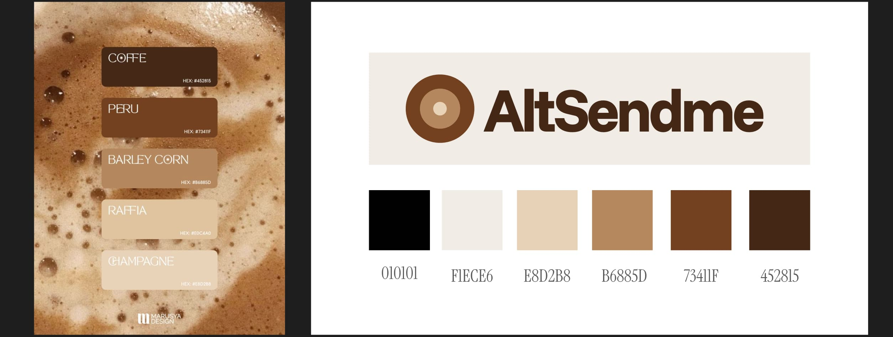
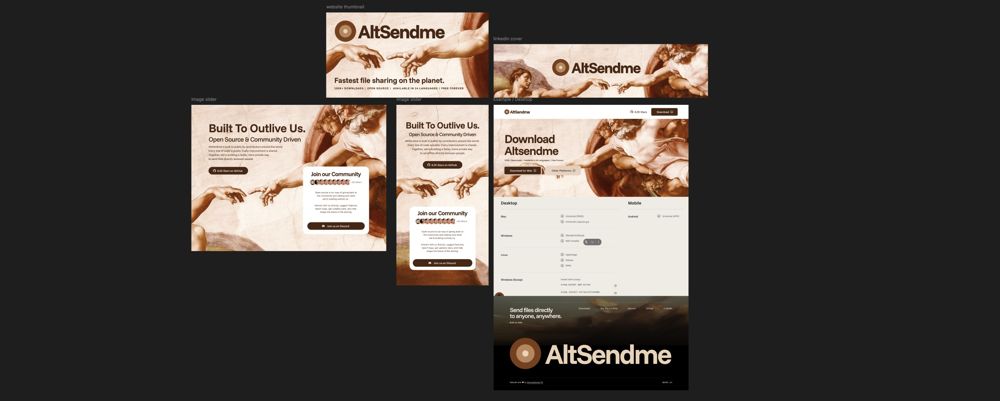

<h2 align="center">
  Design contribution by <a href="https://www.linkedin.com/in/shravankumarps/">Sharavan Kumar PS</a>
</h2>

## Getting Started

Clone the repository, install dependencies, and start the development server:

```bash
git clone https://github.com/tonyantony300/Altsendme-website.git
cd Altsendme-website
npm install
npm run dev
```

Open [http://localhost:3000](http://localhost:3000) in your browser to view the site.

## Contributing

We welcome contributions. To propose a change:

1. Fork the repository and create a branch from `main`.
2. Make your changes and test locally with `npm run dev`.
3. Commit your changes and push to your fork.
4. Open a pull request against `main` with a clear description of what you changed and why.
